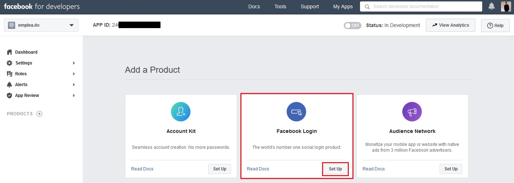
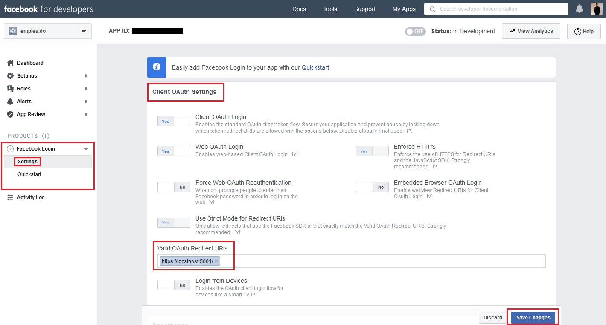
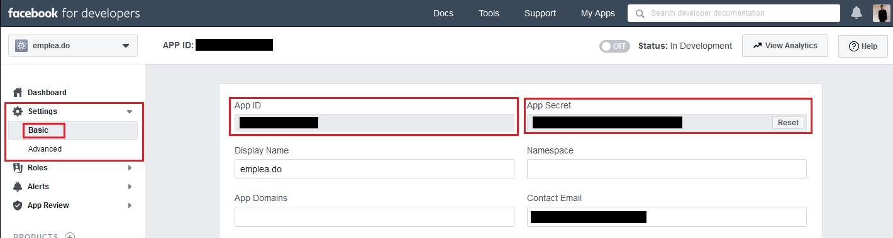
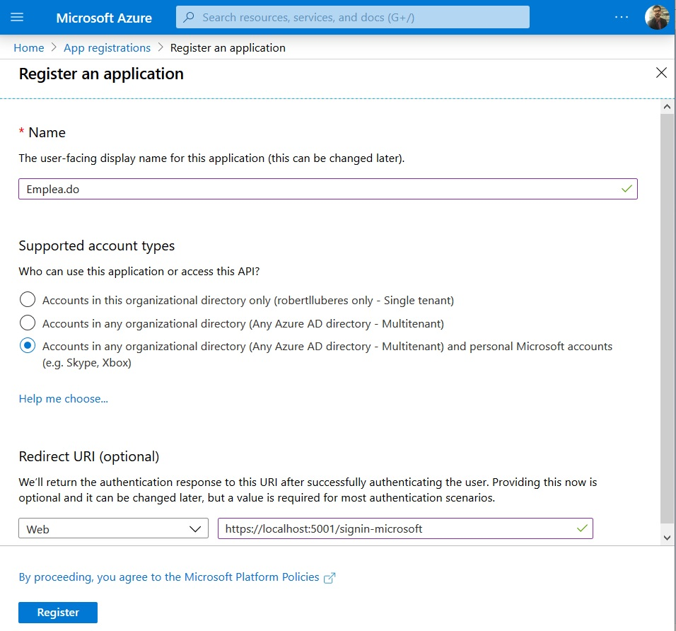
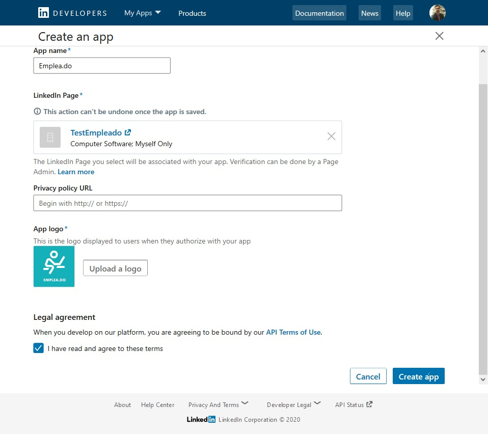
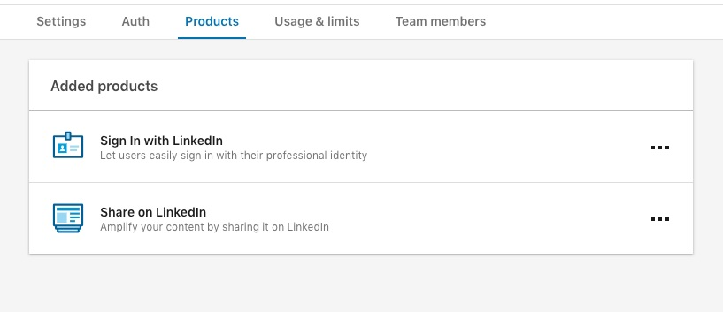

# Authentication

ASP.NET Core Identity is a membership system that adds login functionality to ASP.NET Core apps.

## Instructions

Below you will find the instructions, step-by-step to configure the following external login provider in your development environment.

- [Facebook](#Facebook)
- [Microsoft](#Microsoft)
- [LinkedIn](#LinkedIn)
- [GitHub](#GitHub)
- [Google](#Google)

### Facebook

0. Log In to [Facebook](https://www.facebook.com/) using your account
1. Go to [All Apps - Facebook for Developers](https://developers.facebook.com/apps/)
2. In the upper right corner, select _My Apps_ and then click on _Create App_
3. Fill the fields _Display Name_ and _Contact Email_ then click _Create App ID_
4. You will see in the _Dashboard_ a list of _Products_ that you can add, we're going to configure _Facebook Login_, so, click on the _Set Up_ button for that product
   
5. On the menu on the left, under _Facebook Login_, click on _Settings_. Under the _Client OAuth Settings_, there is a field called Valid _OAuth Redirect URIs_, where you have to put the URL of the project, eg. https://localhost:5001/, and then click on the _Save Changes_ button.
   
6. On the menu on the left, under _Settings_, click on _Basic_, you will see the Facebook _App ID_ and _App Secret_, necessary to configure the Authentication in the project, copy them, you will need it in next step.
   
7. In the _Web_ project go to the file _appsettings.Development.json_ go to the _Facebook_ object, under _Authentication_, paste the _App ID_, and _App Secret_ copied in the previous step.
8. Run the project and Log In using Facebook.

### Microsoft

0. Log In to [Microsoft Azure Portal](https://portal.azure.com/) using your Microsoft account
1. Go to [App registrations](https://portal.azure.com/#blade/Microsoft_AAD_RegisteredApps/ApplicationsListBlade)
2. In the upper left corner, select _New registration_, now we need to fill the basic information about the application:

   - Fill the _Name_ field for the application name, eg.: _Emplea.do_.
   - For _Supported account types_ choose _Accounts in any organizational directory (Any Azure AD directory - Multitenant) and personal Microsoft accounts (e.g. Skype, Xbox)_, this will allow to login anyone with a Microsoft account.
   - For _Redirect URI_ we need to use: https://localhost:5001/signin-microsoft, in the Development Environment this is the local URL that the projects use, appending the '_signin-microsoft_' that identifies the login provider, in this case, Microsoft.
   - Click the _Register_ button.

     

3. In the left menu, select _Certificates & secrets_, under _Client secrets_:

   - Click the _New client secret_ button.
   - Add a _Description_ for the new _client secrete_, eg.: _ClientSecret_
   - Select when this secret _Expires_, eg.: _In 1 year_

   This will generate a new client secret, copy the value we will need it.

4. In the left menu, go to the application _Overview_, there you will see the _Application (client) ID_, copy it, we will need it in the next step.

5. Back in our Emplea.do _Web_ project go to the file _appsettings.Development.json_ to the _Microsoft_ object under _Authentication_ and paste the _App ID_ and _App Secret_ copied in the previous steps.

7) Run the project and Log In using Microsoft.

### LinkedIn

0. Log In to [LinkedIn](https://www.linkedin.com/login) using your account
1. Go to [Developers | Linkedin](https://www.linkedin.com/developers/) and click in the _Create app_ button
2. We need to fill the basic information about the application:

   - Set the _App name_, eg.: _Emplea.do_.
   - LinkedIn Page: select one company page that you have access to, or just create one with testing propose, you can delete it later, eg: _TestEmpleado_
   - Logo, choose the company logo
   - Accept the _Legal agreement_ and click the _Create app_ button

     

3. Go to the _Auth_ tab, in the _OAuth 2.0 settings_ add https://localhost:5001/signin-github in the _Redirect URLs_. From the _Application credentials_ section copy the _Client ID_ and the _Client Secret_, we will need it in the next step.

4. Go to he _Products_ tab, _Select_ the product _Sign In with LinkedIn_, in almost 2 minutes they will approve your application.

   

5. Back in our Emplea.do _Web_ project go to the file _appsettings.Development.json_ to the _Linkedin_ object under _Authentication_ and paste the _ClientId_ and _ClientSecret_ copied in the previous steps.

6. Run the project and Log In using LinkedIn.

### GitHub

0. Log In to [GitHub](https://github.com/) using your account
1. Go to [New OAuth Application](https://github.com/settings/applications/new)
2. We need to fill the basic information about the application:

   - Set the _Application Name_, eg.: _Emplea.do_.
   - _Homepage URL_: https://localhost:5001
   - For _Authorization callback URL_ we need to use: https://localhost:5001/signin-github, in the Development Environment this is the local URL that the projects use, appending the '_signing-github_' that identifies the login provider, in this case, GitHub.
   - Click the _Register Application_ button.

     

3. Copy the _Client ID_ and _Client Secret_, we will need it in the next step.

4. Back in our Emplea.do _Web_ project go to the file _appsettings.Development.json_ to the _Github_ object under _Authentication_ and paste the _ClientId_ and _ClientSecret_ copied in the previous steps.

5. Run the project and Log In using GitHub.

### Google

0. Log In to [Google](https://www.google.com/) using your account
1. Go to [Integrating Google Sign-In into your web app](https://developers.google.com/identity/sign-in/web/sign-in) and click in the _Configure a project_ button
2. From the dropdown, select _+ Create a new project_, we need to fill the basic information about the application:

   - Set the _Project name_ and click next, eg.: _Empleado_.
   - Enter the _Product Name_ and click next, eg.: _Emplea.do_
   - From the dropdown select _Web server_ as _your OAuth client_ and set https://localhost:44343/signin-google as _Authorized redirect URIs_ and click _Create_

3. Copy the _Client ID_ and _Client Secret_, we will need it in the next step.

4. Back in our Emplea.do _Web_ project go to the file _appsettings.Development.json_ to the _Google_ object under _Authentication_ and paste the _ClientId_ and _ClientSecret_ copied in the previous steps.

5. Run the project and Log In using Google.

## References

- [Facebook, Google, and external provider authentication in ASP.NET Core](https://docs.microsoft.com/en-us/aspnet/core/security/authentication/social/index?view=aspnetcore-2.2&tabs=visual-studio)

- [External OAuth authentication providers](https://docs.microsoft.com/en-us/aspnet/core/security/authentication/social/other-logins?view=aspnetcore-2.2)

- [Facebook external login setup in ASP.NET Core](https://docs.microsoft.com/en-us/aspnet/core/security/authentication/social/facebook-logins?view=aspnetcore-2.2)

- [Microsoft Account external login setup with ASP.NET Core](https://docs.microsoft.com/en-us/aspnet/core/security/authentication/social/microsoft-logins?view=aspnetcore-2.2)

- [Authenticating with OAuth 2.0 Overview (LinkedIn)](https://docs.microsoft.com/en-us/linkedin/shared/authentication/authentication?context=linkedin/consumer/context)

- [Authorizing OAuth Apps (GitHub)](https://developer.github.com/apps/building-oauth-apps/authorizing-oauth-apps/)

- [Google external login setup in ASP.NET Core](https://docs.microsoft.com/en-us/aspnet/core/security/authentication/social/google-logins?view=aspnetcore-2.2)
